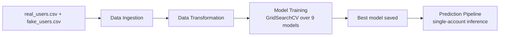

# Fake Account Detection

An end-to-end machine learning pipeline that classifies social media accounts as **real** or **fake** based on profile metadata, activity counts, and free-text fields (name, bio, location, etc.).

The project follows a modular, production-style ML architecture: data ingestion, preprocessing, model training with hyperparameter tuning, and single-account prediction are all decoupled components that can be run independently.

## Features

- **Automated data ingestion** — loads real and fake user datasets, labels them, shuffles, and performs a stratified train/test split.
- **Hybrid preprocessing** — a single `ColumnTransformer` pipeline that handles:
  - Numerical/count/flag columns → median imputation + standardization
  - Categorical columns (lang, time zone, profile colors) → most-frequent imputation + one-hot encoding
  - Free-text columns (name, screen name, description, location) → TF-IDF vectorization (per-column vocabularies)
- **Multi-model benchmark** — 9 classifiers trained and tuned automatically via `GridSearchCV`, with the best model selected by test accuracy:
  - Logistic Regression, Decision Tree, Random Forest, Gradient Boosting, XGBoost, CatBoost, SVM, KNN, Naive Bayes
- **Prediction pipeline** — reloads the saved preprocessor and model to classify individual accounts, returning the label plus fake-account probability when the model supports it.
- **Robust inference defaults** — missing or empty input fields are kept as `NaN` so the fitted imputers apply the exact training-time statistics instead of pushing inputs out of distribution.
- **Custom logging and exception handling** across all components.

## Project Structure

```
fake-account-detection/
├── data/                          # Raw datasets
│   ├── real_users.csv             # Real accounts (label 0)
│   └── fake_users.csv             # Fake accounts (label 1)
├── notebook/                      # EDA notebooks
│   ├── eda_fake_social_media.ipynb
│   ├── eda_real_users.ipynb
│   ├── eda_fake_users.ipynb
│   └── eda_fake_social_media_global_2.0_with_missing.ipynb
├── src/
│   ├── components/
│   │   ├── data_ingestion.py      # Load, label, split → artifacts/
│   │   ├── data_transformation.py # Preprocessing + feature engineering
│   │   └── model_training.py      # Multi-model tuning & selection
│   ├── pipeline/
│   │   └── predict_pipeline.py    # Single-account inference
│   ├── exception.py               # Custom exception handling
│   ├── logger.py                  # Logging configuration
│   └── utils.py                   # save/load objects, model evaluation
├── artifacts/                     # Generated at runtime
│   ├── raw.csv                    # Combined labeled dataset
│   ├── train.csv / test.csv       # Stratified splits
│   ├── preprocessor.pkl           # Fitted preprocessing pipeline
│   └── model.pkl                  # Best trained model
├── train.py                       # CLI entry point (train / predict)
├── setup.py
└── requirements.txt
```

## Dataset

The project uses two CSV datasets of social media (Twitter-style) profiles, each with 2,500 records and 34 attributes:

| File | Records | Label |
|---|---|---|
| `data/real_users.csv` | 2,500 | `0` (Real) |
| `data/fake_users.csv` | 2,500 | `1` (Fake) |

Key features used by the model:

- **Activity counts** — `statuses_count`, `followers_count`, `friends_count`, `favourites_count`, `listed_count`
- **Account flags** — `verified`, `protected`, `geo_enabled`, `default_profile`, `default_profile_image`, etc.
- **Categorical metadata** — `lang`, `time_zone`, profile color attributes
- **Free text** — `name`, `screen_name`, `description`, `location` (TF-IDF features)

Identifier/URL/timestamp columns (`id`, `created_at`, `url`, profile image URLs, etc.) are dropped to prevent target leakage.

## Getting Started

### Prerequisites

- Python 3.10+

### Installation

```bash
# Clone the repository
git clone https://github.com/<your-username>/fake-account-detection.git
cd fake-account-detection

# (Optional) Create a virtual environment
python -m venv venv
venv\Scripts\activate        # Windows
source venv/bin/activate     # Linux / macOS

# Install dependencies
pip install -r requirements.txt
pip install -e .
```

### Training

Runs the full pipeline — ingestion, transformation, and model training/tuning — then prints the best model and its accuracy:

```bash
python train.py
```

Artifacts written to the `artifacts/` directory: `raw.csv`, `train.csv`, `test.csv`, `preprocessor.pkl`, `model.pkl`.

### Prediction

Classifies sample accounts using the saved preprocessor and model:

```bash
python train.py --predict
```

### Using the Prediction Pipeline in Code

```python
from src.pipeline.predict_pipeline import predict_account

account = {
    "statuses_count": 1200,
    "followers_count": 340,
    "friends_count": 280,
    "favourites_count": 50,
    "listed_count": 2,
    "verified": 0,
    "lang": "en",
    "time_zone": "UTC",
    "name": "John Doe",
    "screen_name": "johndoe",
    "description": "Software developer. Coffee enthusiast.",
    "location": "New York",
}

result = predict_account(account)
print(result)
# {'prediction': 'Real Account', 'fake_probability': 0.0312}
```

Missing or empty fields are handled gracefully — they are passed through as `NaN` and filled by the imputers learned during training.

## How It Works



1. **Data Ingestion** (`src/components/data_ingestion.py`) — loads both CSVs, assigns labels (real = 0, fake = 1), shuffles, and performs an 80/20 stratified split.
2. **Data Transformation** (`src/components/data_transformation.py`) — builds and fits a `ColumnTransformer` (numerical scaling, one-hot encoding, per-column TF-IDF), saves the fitted preprocessor, and returns dense feature arrays.
3. **Model Training** (`src/components/model_training.py`) — runs `GridSearchCV` (3-fold) for each of the 9 models, refits the best estimator with its tuned parameters, selects the winner by test accuracy (threshold 0.6), and saves it via `dill`/`pickle`.
4. **Prediction** (`src/pipeline/predict_pipeline.py`) — reloads the preprocessor and model artifacts and classifies a single account, returning the label and fake-account probability.

## Tech Stack

- **Language:** Python 3.10+
- **ML & Data:** pandas, NumPy, scikit-learn, XGBoost, CatBoost
- **Serialization:** dill, pickle
- **Notebooks:** Jupyter (ipykernel), nbformat, nbclient

## Roadmap

- [ ] Web app / REST API for real-time account scoring
- [ ] Model versioning and experiment tracking
- [ ] Additional evaluation metrics dashboard (precision/recall/F1 per model)
- [ ] Dockerized deployment

## License

This project is available under the [MIT License](LICENSE).

---

Built by [Hasibul](mailto:hasibulhasanjoy.007@gmail.com)
